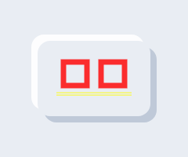
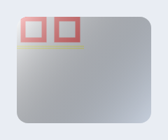

## neumorphic_flutter_kr

[](LICENSE)
[](https://flutter.dev)
[](https://dart.dev)
[](https://docs.flutter.dev/development/platform-integration)

## 요약
간단한 UI의 대표 중 하나인 뉴로모픽 디자인을 한글 API로 쉽게 쓰는 Flutter 위젯/샘플입니다.
조정하시고, 코드를 긁어가시고, 인사이트도 얻어가세요!

---

뱃지란? README 상단에 표시되는 작은 상태 라벨로, 라이선스/버전/지원 플랫폼 등을 한눈에 보여줍니다. 위 배지는 라이선스(MIT), 요구 Flutter/Dart 버전, 지원 플랫폼 정보를 담고 있어요.

### 특징
- 한글 친화·직관 API: depth(깊이), lightSource(광원), radius(곡률), color(배경색)
- 최소 설정으로 자연스러운 양·음영 박스 효과(눌림/돌출)
- 경량 의존성, 웹/모바일/데스크톱 모두 지원
- 예제 앱에서 실시간 조정 + 코드 자동 생성/복사 제공
 - 다크모드 토글·텍스트 스케일(접근성) 조절 지원

### 설치
pub.dev 등록 전에는 로컬 path 의존성으로 사용하세요.

```yaml
dependencies:
	neumorphic_flutter_kr:
		path: ../neumorphic_flutter_kr
```

### 빠른 시작
```dart
import 'package:flutter/material.dart';
import 'package:neumorphic_flutter_kr/neumorphic_flutter_kr.dart';

class Demo extends StatelessWidget {
	const Demo({super.key});
	@override
	Widget build(BuildContext context) {
		return const Center(
			child: NeumorphicBox(
				padding: EdgeInsets.all(24),
				child: Text('눌러보세요'),
			),
		);
	}
}
```

### 인터랙티브 데모 실행
실시간으로 깊이/곡률/광원/배경색을 조정하고, 생성된 코드를 복사할 수 있습니다.

```bash
cd example
flutter run -d chrome   # 웹(크롬)
# 또는
flutter run -d ios      # iOS 시뮬레이터
flutter run -d android  # Android 에뮬레이터
```

### 시각 샘플(골든 테스트 이미지)
돌출(emboss)



눌림(pressed)



### 링크
- 지원 버전 안내: [SUPPORT.md](SUPPORT.md)
- 변경 로그: [CHANGELOG.md](CHANGELOG.md)
